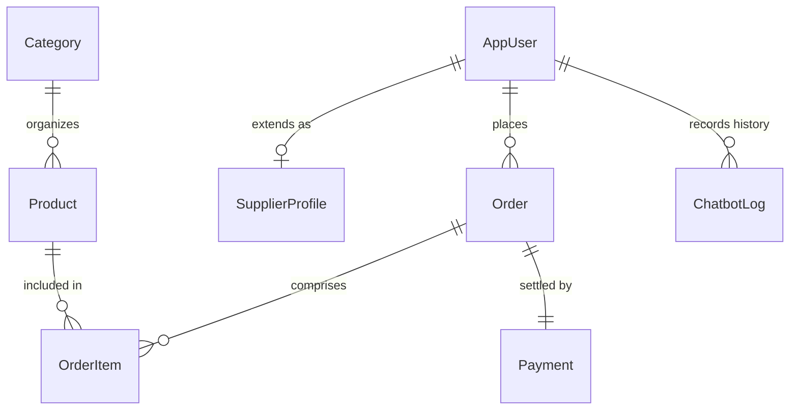
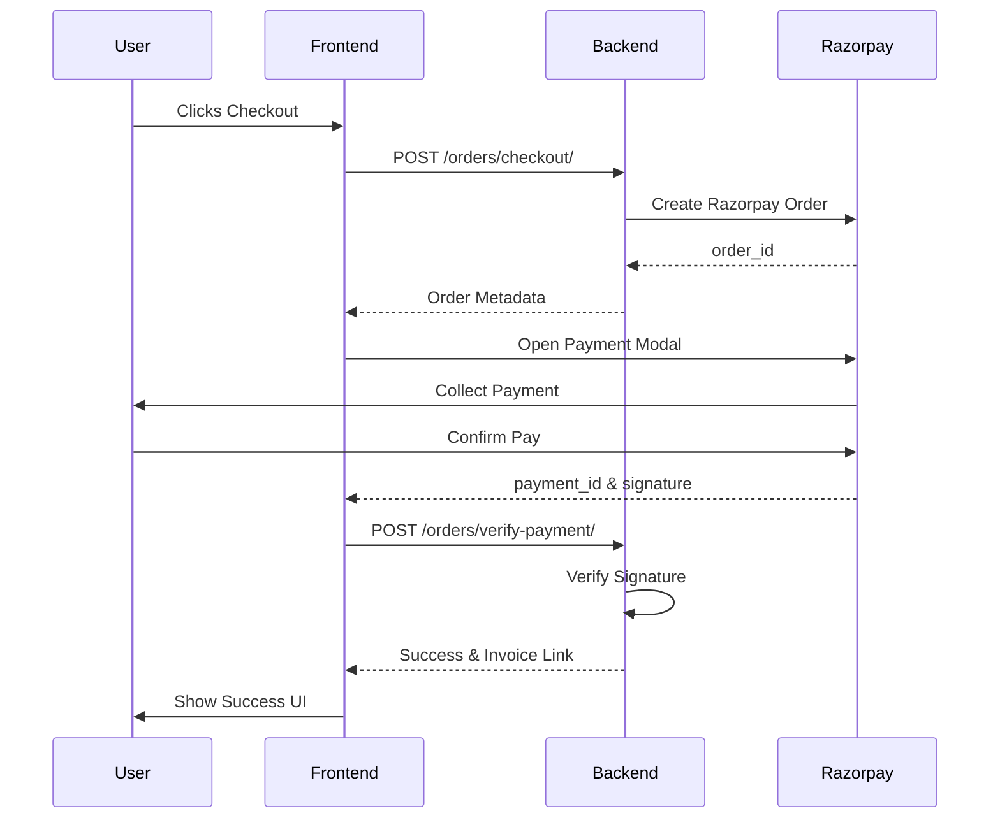

# 🛒 Master Project Report: Bloom & Buy
## Smart AI-Driven E-commerce Ecosystem

This report provides a comprehensive technical overview of the **Bloom & Buy** platform, a production-ready, full-stack application designed to revolutionize the "Smart" shopping experience through AI integration, multi-channel notifications, and robust financial security.

---

## 📋 Table of Contents
1. [Executive Summary](#01-executive-summary)
2. [Technical Stack](#02-technical-stack)
3. [Frontend Architecture](#03-frontend-architecture)
4. [Backend Infrastructure](#04-backend-infrastructure)
5. [Database Design](#05-database-design)
6. [User Manual](#06-user-manual)
7. [Security Measures](#07-security-measures)
8. [Deployment & DevOps](#08-deployment--devops)
9. [System Workflows](#09-system-workflows)

---

## 01. Executive Summary
**Bloom & Buy** is a multi-role marketplace that manages interactions between **Consumers**, **Suppliers (Sellers)**, and **Admins**. 

### Core Value Proposition:
- **AI Intelligence:** Integrated OpenAI GPT models for natural language product discovery.
- **Notification Mesh:** Automated real-time alerts via Email, SMS, and WhatsApp (Twilio).
- **Financial Integrity:** Secure payment processing with Razorpay and automated PDF invoicing.
- **Performance:** High-speed rendering using the React 19 + Vite frontend.

---

## 02. Technical Stack
The platform uses a modern, scalable stack chosen for performance and developer productivity.

| Layer | Technology | Purpose |
| :--- | :--- | :--- |
| **Frontend** | React 19 + Vite | Fast, interactive UI with glassmorphic aesthetics. |
| **Backend** | Django 6.0 + DRF | Secure, modular RESTful API backbone. |
| **Database** | PostgreSQL (Neon.tech) | Robust, serverless relational database. |
| **Authentication**| JWT (JSON Web Tokens)| Stateless, secure user sessions. |
| **Notifications** | Twilio + SMTP | SMS, WhatsApp, and HTML Email workflows. |
| **AI Layer** | OpenAI GPT-3.5/4 | Natural language processing for "BloomBot". |
| **Payments** | Razorpay SDK | Integrated checkout with signature verification. |

---

## 03. Frontend Architecture
The frontend is a Single Page Application (SPA) optimized for speed and reusability.

### 3.1 Directory Structure
- `src/context/`: Contains `AuthContext` (identity) and `CartContext` (basket management).
- `src/utils/api.js`: A modular Axios instance with request/response interceptors for JWT injection.
- `src/components/`: Reusable UI elements like `Navbar`, `ProductCard`, and `Chatbot`.
- `src/pages/`: Highly interactive views for different roles (Admin Dashboard, Seller Panel, Wishlist).

### 3.2 State Management & Hook Logic
- **Prop Drilling Removal:** Context API is used for global state.
- **Protected Routing:** Custom `AdminRoute` and `SellerRoute` components in `App.jsx` prevent unauthorized access via navigation guards.

---

## 04. Backend Infrastructure
The Django backend follows a domain-driven design structure.

### 4.1 Modular App Breakdown
- **`accounts/`**: Handles authentication, registration, and JWT token issuing.
- **`store/`**: Manages the product catalog, categories, and inventory scoring.
- **`orders/`**: Contains the checkout engine, Razorpay logic, and automated PDF invoice generation.
- **`ai_features/`**: The gateway for OpenAI queries and RAG (Retrieval Augmented Generation) logic.
- **`users/`**: Manages the notification mesh and user profiles.

---

## 05. Database Design
The relational schema ensures data integrity and optimized query performance.

### 5.1 ER Diagram Highlights

### 5.2 Key Tables
- **AppUser:** Unified identity table with role-based flags.
- **Product:** Rich inventory details including `approval_status` for admin moderation.
- **Order:** Transaction tracking with live status (Pending, Shipped, Delivered).

---

## 06. User Manual

### 6.1 Admin Dashboard
> [!NOTE]
> Used by the platform owner to maintain marketplace quality.
- **Product Moderation:** Review and Approve/Reject products listed by suppliers.
- **User Management:** Monitor active users and manage seller applications.
- **Analytics:** View real-time charts for total sales and user growth.

### 6.2 Seller Panel
- **Inventory Control:** Create, edit, and delete products.
- **Order Fulfillment:** Receive notifications for new orders and update fulfillment status.
- **Store Stats:** Track personal revenue and best-selling items.

### 6.3 Consumer Portal
- **Smart Search:** Use the "BloomBot" chat bubble to ask for budget-friendly recommendations.
- **Secure Checkout:** Multi-step address selection followed by a secure Razorpay modal.
- **Order Tracking:** Real-time progress tracking from the "My Orders" page.

---

## 07. Security Measures
The platform implements multiple layers of protection to safeguard user data and financial assets.

- **Authentication (JWT):** Tokens are issued upon login and stored securely after verification. Expired tokens trigger automatic logout via Axios interceptors.
- **CORS Policy:** Restricts API access only to the authorized frontend domain (Render).
- **Password Hashing:** Uses industry-standard hashing (BCrypt/Argon2) within Django’s auth framework.
- **Environment Hardening:** All sensitive keys (OpenAI, Twilio, Razorpay) are stored in server-side environment variables, never exposed to the client.

---

## 08. Deployment & DevOps
The application is deployed on **Render** (PaaS) for seamless scalability.

- **Live URL:** [https://smart-ecommerce-frontend.onrender.com](https://smart-ecommerce-frontend.onrender.com)
- **Deployment Blueprint:** Managed via `render.yaml`.
- **Database Hosting:** **Neon.tech** (Serverless PostgreSQL) ensures 99.9% uptime.
- **Static Asset Handling:** Uses `WhiteNoise` for efficient serving of frontend build files.

---

## 09. System Workflows

### 9.1 Checkout & Payment Flow

---
*Created by Antigravity AI for the Bloom & Buy Project team.*
